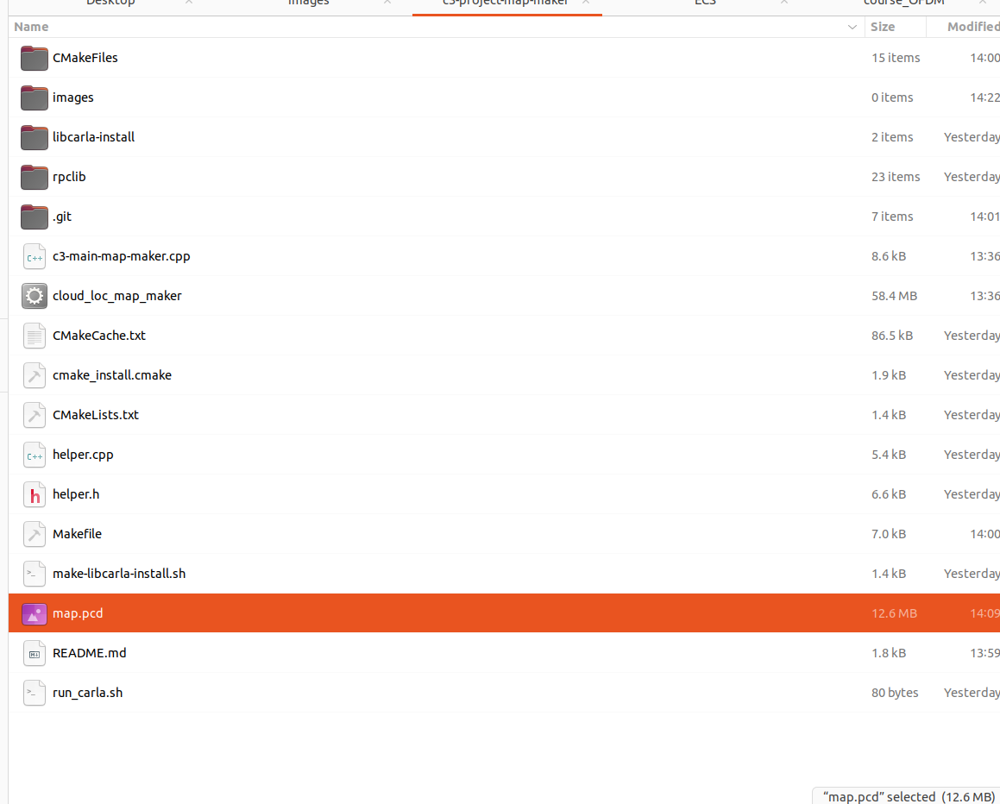

# Instructions to Execute the Project
This repository is made for generating the lidar map file for [Udacity Scan Matching Localization project](https://github.com/udacity/nd0013_cd2693_Exercise_Starter_Code/tree/main/Lesson_7_Project_Scan_Matching_Localization/c3-project).

Evert parts are the same as the original project except this code accumulates the scanned lidar and saves it under PCD file


1. Compile the project using the following commands. 

    ```bash
    cmake .
    make
    ```
    These steps will generate the **cloud_loc_map_maker** executable.
   
2. Open a new Terminal tab and execute the following command to start the simulator.
    ```bash
    ./run_carla.sh
    ```
    
3. Open another Terminal tab and execute the following to run the project.
    ```bash
    ./cloud_loc_map_maker 
    ```
    
4. Please tap the Up key 2~3 times to start the vehicle.

5. Lidar data will be accumulated per 1m driving range. You can manually set the parameter of the code. Please check the below part of the code.
```
for (size_t i = 0; i < cloudFiltered->size(); ++i){
    //cout << "scanCloud->points[i].x: " << scanCloud->points[i].x << endl;
    cloudFiltered->points[i].x += distDriven;
    //scanCloud->points[i].z -= 1;
}

if (distDriven - lastDistDriven >= 1) {
    *accumulatedCloud += *cloudFiltered;
    lastDistDriven = distDriven;
}

cout << "distDriven: " << distDriven << endl;
if (distDriven >= 175) {
    if (save == true) {
        pcl::io::savePCDFileASCII ("map.pcd", *accumulatedCloud);
        save = false;
    }
}
```

6. After 175m driving, the PCD file will be saved under ```map.pcd``` file of the project folder.

   
8. Live Demo Video
[](https://youtu.be/AmmJID_VS9Y)
